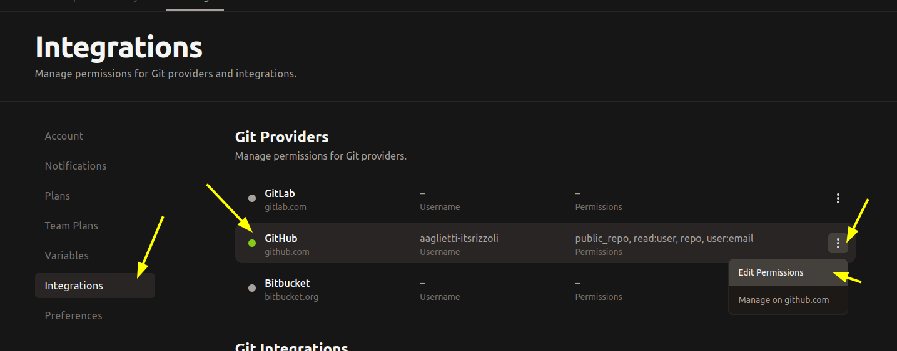

# 4 fork, branch and commit

## Enable GitHub sidebar

Click the GitHub sidebar, GitPod will ask some authorization and it will fail.

We need to go on https://gitpod.io/integrations and edit the permission on the GitHub integration.

selecting permission as follow

click _Update permissions_ and go back to the GitHub sidebar on your GitPod.

Now it'll go straight and show your GitHub Pull Requests and Issues for this repo (nothing for now).

## GitHub CLI login

To fork a repo we can do it from the GitHub interface or from the GitHub CLI.

We'll use the GitHub CLI :)

So to start we need to login on the GitHub CLI, type `gh auth login` in the VSCode terminal and answer as follow

### Create the token for the GitHub CLI login

Open https://github.com/settings/token as suggested by the CLI message then

then select permissions

finally paste the token to the CLI.

## Repo fork with the GitHub CLI

Simple type `gh repo fork` in the terminal.

**From now the new default remote repository is our fork.**
