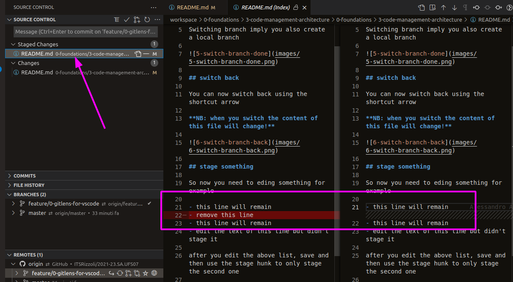

# 1 stage and unstage

Great you are good to switching branches!!

Switching branch imply you also create a local branch

## switch back

You can now switch back using the shortcut arrow

**NB: when you switch the content of this file will change!**

## stage a single line directly in the editor

So now you need to eding something for example

- this line will remain
- remove this line
- this line will remain
- edit the text of this line but didn't stage it

after you edit the above list, save and then use the stage hunk to only stage the second one.

To open the Git action menu' only for a single change you need to click on the right to the source code near line numbers
- red triangle means line removed
- blu highlight mean changes
- red highligh mean additions

On the top right of the popup you'll find some useful actions.

The + will add to our staging area only a single line.

## see the diff between staging area and the local repo

after that you'll some changes on the sidebar, the GUI tell us that something is staged and something not.

If we want to see the diff on what's staged we need to click on the file and a diff will be opened. (same as `git status --staged`)

